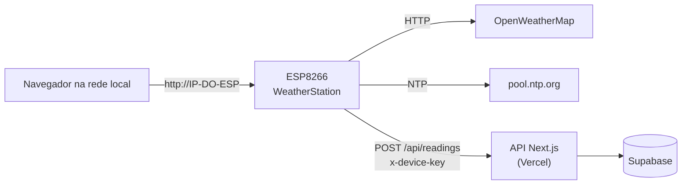

# 🌦️ WeatherStation ESP8266

Estação meteorológica doméstica com **ESP8266**, display **OLED**, sensor de **temperatura e umidade interna**, clima e previsão do **OpenWeatherMap**, **página web** responsiva servida pelo próprio ESP, **configuração 100% pelo navegador**, leitura de **bateria**, **LED de status**, **OTA** e envio das leituras para uma **API/painel web** (Next.js + Vercel + Supabase).


> Projeto baseado no exemplo **WeatherStation** da biblioteca [ThingPulse ESP8266 Weather Station](https://github.com/ThingPulse/esp8266-weather-station) (MIT), bastante ampliado.

<!-- Adicione suas fotos e capturas de tela em docs/img/ e referencie aqui, por exemplo:


-->

---

## 📑 Sumário

1. [Recursos](#-recursos)
2. [Como funciona](#-como-funciona)
3. [Telas do display OLED](#-telas-do-display-oled)
4. [Página web local](#-página-web-local)
5. [Hardware](#-hardware)
6. [Ligações](#-ligações)
7. [Instalação do software](#-instalação-do-software)
8. [Primeira configuração](#-primeira-configuração)
9. [Página de configuração (`/config`)](#-página-de-configuração-config)
10. [Bateria](#-bateria)
11. [LED de status](#-led-de-status)
12. [Envio para o painel web (API)](#-envio-para-o-painel-web-api)
13. [Endpoints locais](#-endpoints-locais)
14. [Personalização no código](#-personalização-no-código)
15. [Segurança](#-segurança)
16. [Solução de problemas](#-solução-de-problemas)
17. [Estrutura do repositório](#-estrutura-do-repositório)
18. [Histórico de versões](#-histórico-de-versões)
19. [Ideias futuras](#-ideias-futuras)
20. [Créditos e licença](#-créditos-e-licença)

---

## ✨ Recursos

**Clima e sensores**
- Temperatura e umidade **internas** (DHT22/DHT11) com uma casa decimal.
- Clima **atual** e previsão de **3 dias** via OpenWeatherMap (temperatura, mín/máx, umidade, pressão, vento, visibilidade, nuvens, nascer e pôr do sol).
- **Histórico** das últimas ~12 h de temperatura e umidade internas (um ponto a cada 5 min), com gráfico interativo na página web.

**Interface**
- Display OLED 0,96" com **6 telas** animadas e barra inferior com hora e temperatura externa.
- **Página web responsiva** (celular e computador): clima, cartões, bússola de vento, anel de umidade, previsão, gráfico com eixos e seleção de ponto, ícones de configurações, tela, sinal WiFi e bateria.
- Tema escuro, sem dependência de internet para exibir a página (tudo embutido no ESP).

**Configuração sem editar código** (salva na flash/EEPROM)
- Chave da API, cidade e idioma do OpenWeatherMap.
- **Fuso horário** (34 opções) e horário de verão.
- **Ligar/apagar a tela** e **agenda automática** (ex.: apagar das 23:00 às 06:00).
- **Bateria** ativável por dispositivo (cada ESP pode ou não ter bateria).
- Dados do painel web: ID do dispositivo, URL da API e `DEVICE_KEY`.
- Portal de configuração de WiFi (WiFiManager).

**Conectividade e manutenção**
- Atualização **OTA** protegida por senha.
- **LED azul de status**: conectando, sem WiFi, enviando dados, sucesso e falha.
- Envio periódico das leituras para uma **API REST** (a cada 15 min) e botão **"Enviar dados agora"**.
- Aba **Sistema** com memória, flash, motivo do último reinício, versão do firmware etc.

---

## 🧭 Como funciona



| Tarefa | Intervalo |
|---|---|
| Leitura do sensor interno | a cada 10 s |
| Clima atual e previsão (OpenWeatherMap) | a cada 15 min (nova tentativa em 1 min sem WiFi, em 5 min se a API falhar) |
| Ponto do histórico interno | a cada 5 min (144 pontos ≈ 12 h, ficam na RAM) |
| Leitura da bateria | a cada 30 s (média móvel) |
| Envio ao painel web (API) | a cada 15 min (1º envio 20 s após ligar; falhou, tenta de novo em 2 min) |
| Atualização dos números na página web | a cada 5 s (gráfico a cada 60 s) |

---

## 📟 Telas do display OLED

As telas deslizam automaticamente. A barra inferior mostra a hora (esquerda) e a temperatura externa (direita).

1. **Data e hora**
2. **Clima interno** (umidade e temperatura, uma casa decimal)
3. **Clima atual** (ícone, temperatura, cidade e descrição)
4. **Previsão de hoje** (mín, máx, umidade, pressão, visibilidade e vento)
5. **Próximos 3 dias**
6. **WiFi e bateria** (veja abaixo)

Tela 6, na ordem das linhas:

```
[▮▮▮▯] 85%  3.92V        1. bateria (ícone, percentual e tensão)
▂▄▆█   -62dBm  76%       2. sinal do WiFi (ícone de barras, dBm e %)
SSID: MinhaRede          3. nome da rede
IP: 192.168.0.50         4. IP (use no navegador)
```

O ícone de sinal tem 4 barras: 75% ou mais enche as 4, 50% as 3, 25% as 2 e qualquer sinal acende 1. Sem WiFi, as barras ficam vazias e aparece "sem WiFi".

---

## 🌐 Página web local

Abra `http://IP-DO-ESP/` (o IP aparece na tela 6 do OLED).

**Barra superior:** engrenagem (abre a `/config`), botão de **ligar/apagar a tela** (com risca vermelha quando apagada), **sinal de WiFi** (4 barras, com dBm e % ao passar o mouse) e **bateria** (ícone com percentual, só se ativada).

**Avisos:** faixa amarela de bateria baixa (≤ 20%), vermelha de bateria crítica (≤ 10%) e aviso quando não for possível obter o clima.

**Conteúdo:** clima atual, umidade, pressão, vento (com bússola), visibilidade, nuvens, nascer e pôr do sol, clima interno (com anel de umidade), previsão dos próximos dias e **histórico interno** com eixos (temperatura à esquerda, umidade à direita), horários e leitura exata do ponto ao passar o mouse ou arrastar o dedo.

**Rodapé:** horário da última atualização e dados do WiFi (`WiFi -62 dBm (76%)`).

---

## 🧰 Hardware

**Lista de materiais**

| Item | Observação |
|---|---|
| ESP8266 (NodeMCU / ESP-12E) | Modelo comum **ou** NodeMCU com OLED integrado |
| Display OLED 0,96" I2C | SSD1306 ou SSD1315 (compatível), endereço `0x3C` |
| Sensor **DHT22** (recomendado) ou DHT11 | Mesma biblioteca; o DHT22 é mais preciso e mede abaixo de 0 °C |
| Resistor 10 kΩ | Só se o DHT for o de 4 pinos solto (pull-up no dado) |
| *(opcional)* Bateria Li-ion 18650 | Com módulo de carga/proteção (ex.: TP4056 com proteção) |
| *(opcional)* Resistor 100 kΩ | Divisor para ler a bateria no A0 |
| Jumpers e protoboard | |

---

## 🔌 Ligações

### Variante A: ESP8266 comum + OLED externo (padrão do código)

| Componente | Pino do ESP8266 |
|---|---|
| OLED SDA | **D2** (GPIO4) |
| OLED SCL | **D1** (GPIO5) |
| OLED VCC / GND | 3V3 / GND |
| DHT22 dado | **D5** (GPIO14) |
| DHT22 VCC / GND | 3V3 / GND |
| Bateria (via divisor) | **A0** |
| LED azul (status) | interno (GPIO2 = D4; em algumas NodeMCU também GPIO16 = D0) |

**Por que D1/D2 no display:** são os pinos I2C padrão e não têm função especial no boot. Evite **D3 (GPIO0), D4 (GPIO2) e D8 (GPIO15)**, que são pinos de boot, e lembre que o D4 é o LED.

### Variante B: NodeMCU com OLED integrado

O OLED já vem soldado em **D5 (SDA)** e **D6 (SCL)** neste modelo (confirmado na prática; algumas fichas de venda trazem esses números trocados). Ajuste no código:

```cpp
const int SDA_PIN = D5;
const int SDC_PIN = D6;
```

E ligue o sensor em outro pino, por exemplo o **D2**:

```cpp
#define DHTPIN 4                        // GPIO4 = D2
```

Se a tela ficar em branco, troque `SDA_PIN` e `SDC_PIN` entre si.

### Sensor DHT11 em vez de DHT22

Troque apenas o tipo (a biblioteca é a mesma):

```cpp
#define DHTTYPE DHT11
```

O DHT11 mede em passos inteiros (a casa decimal ficará sempre zero), com precisão menor e só de 0 a 50 °C.

### Bateria no A0

O ADC do ESP8266 lê só de **0 a 1 V**. As placas NodeMCU têm um divisor interno de 220 kΩ / 100 kΩ (entrada de até ~3,2 V). Para medir uma Li-ion (até 4,2 V), coloque **100 kΩ em série**:

```
Bateria (+) ──[ 100 kΩ ]── A0
Bateria (−) ────────────── GND
```

Fator total do divisor = (100k + 220k + 100k) / 100k = **4,2** (`BAT_FATOR`). Sem divisor interno na placa, use R2 = 100 kΩ e R1 = (fator − 1) × R2.

> ⚠️ **Nunca ligue uma Li-ion de 4,2 V direto no pino 3V3**: o ESP8266 aceita no máximo cerca de 3,6 V. Alimente por uma entrada com regulador e use módulo de carga com proteção.

---

## 💻 Instalação do software

### 1. Arduino IDE e placa
1. Instale a [Arduino IDE](https://www.arduino.cc/en/software).
2. Em **Preferências → URLs adicionais**, inclua:
   `http://arduino.esp8266.com/stable/package_esp8266com_index.json`
3. Em **Gerenciador de Placas**, instale **esp8266** (pacote da comunidade ESP8266).
4. Selecione a placa **NodeMCU 1.0 (ESP-12E Module)**.

### 2. Bibliotecas (Gerenciador de Bibliotecas)

| Biblioteca | Autor |
|---|---|
| **ESP8266 Weather Station** | ThingPulse / Daniel Eichhorn |
| **JSON Streaming Parser** | Daniel Eichhorn |
| **ESP8266 and ESP32 OLED driver for SSD1306 displays** | ThingPulse |
| **WiFiManager** (série 2.x) | tzapu |
| **DHT sensor library** (+ **Adafruit Unified Sensor**) | Adafruit |

Já fazem parte do pacote ESP8266: `ESP8266WiFi`, `ESP8266WebServer`, `ArduinoOTA`, `EEPROM`, `Ticker`, `ESP8266HTTPClient` e `WiFiClientSecure`.

### 3. Gravar
1. Coloque `WeatherStation.ino`, `WeatherStationFonts.h` e `WeatherStationImages.h` **na mesma pasta chamada `WeatherStation`**.
2. Conecte o ESP por USB, escolha a porta e clique em **Carregar**.
3. Nos envios seguintes, a placa também aparece como **porta de rede** (OTA). A IDE pede a senha definida em `ArduinoOTA.setPassword(...)`.

---

## 🚀 Primeira configuração

1. **Ligue o ESP.** Sem WiFi salvo, ele cria a rede **`ESP_WeatherStation`** (sem senha) e o LED pisca rápido.
2. Conecte-se a ela pelo celular. O portal abre sozinho (ou acesse `192.168.4.1`). Escolha a sua rede e informe a senha.
3. O ESP reinicia e conecta. Veja o **IP** na tela 6 do OLED (ou na lista de clientes do roteador).
4. Abra `http://IP-DO-ESP/` no navegador e toque na **engrenagem** para abrir a `/config`.
5. Na aba **Clima**, informe a **chave da API do OpenWeatherMap**, o **ID da cidade** e escolha o **idioma** e o **fuso**.
6. Pronto. Se quiser enviar para o painel, preencha também **Painel web (API)** (veja [mais abaixo](#-envio-para-o-painel-web-api)).

**OpenWeatherMap:** crie a conta e a chave em <https://home.openweathermap.org/api_keys> (chaves novas podem levar um tempo para ativar). Para o ID da cidade, busque em <https://openweathermap.org/find> e copie o número no fim do endereço (`.../city/3448439`). Você pode colar o endereço inteiro no campo.

> 💡 O padrão do código é fuso `-3` (Brasília), sem horário de verão, idioma `pt_br`.

---

## 🔧 Página de configuração (`/config`)

A página é dividida em **abas**; cada ação salva volta para a aba certa com uma mensagem de confirmação.

| Aba | O que tem |
|---|---|
| **Clima** | Chave da API, ID da cidade, idioma (7 opções), fuso horário (34 opções) e horário de verão; seção **Painel web (API)** com ID do dispositivo, URL da API, `DEVICE_KEY`, botão **Enviar dados agora**, resultado do último envio e cidade enviada |
| **Tela** | Ligar/apagar o display e **horário automático** (ligar às / apagar às; aceita janela que passa da meia-noite) |
| **Bateria** | Ativar/desativar a leitura (por dispositivo) e estado: carga, tensão e situação |
| **WiFi** | Dados da conexão com ícone de sinal, abrir o portal de configuração e apagar a rede salva |
| **Sistema** | Tempo ligado, motivo do último reinício, hora (NTP), chip, CPU, flash, programa, memória, firmware, versão do core |

Tudo é gravado na EEPROM e sobrevive a reinicializações e a novos uploads (só uma limpeza total da flash apaga). Campos de chave aceitam deixar em branco para **manter o valor atual**; só os 4 últimos caracteres aparecem.

**Agenda da tela:** o botão manual vale até o próximo horário programado. A agenda depende da hora da internet (NTP), então só age depois de sincronizar.

---

## 🔋 Bateria

Ative em **`/config` → Bateria**. A leitura usa média móvel (90% do valor anterior + 10% do novo) a cada 30 s, então reage devagar de propósito.

**Calibração:** compare a tensão mostrada com a de um multímetro e ajuste no código:

```cpp
const float BAT_FATOR  = 4.2f;          // divisor de tensão (veja Ligações)
const float BAT_CALIB  = 0.99947619f;   // tensão do multímetro ÷ tensão lida (calibre a sua)
```

**Curva de carga** (interpolação linear entre os pontos, ajustada com multímetro):

| Tensão (V) | 4,20 | 4,15 | 4,10 | 4,015 | 3,93 | 3,84 | 3,755 | 3,68 | 3,61 | 3,48 | 3,29 | 3,00 |
|---|---|---|---|---|---|---|---|---|---|---|---|---|
| Carga (%) | 100 | 95 | 90 | 80 | 70 | 60 | 50 | 40 | 30 | 20 | 10 | 0 |

Os pontos ficam no vetor `V[]`/`P[]` da função `bateriaPercentual()`. Os avisos usam `BAT_AVISO_PCT` (20%) e `BAT_CRITICA_PCT` (10%).

O percentual é uma **estimativa pela tensão**: cai sob carga e varia com a temperatura e o desgaste da célula. A aba Bateria também mostra a **situação** por faixa de tensão (de "Totalmente carregada" a "Descarga profunda").

> Com o OLED aceso e o WiFi sempre ligado, o ESP8266 consome algo como 80 a 150 mA. Uma 18650 dura em torno de um dia. Para longa duração seria necessário *deep sleep*, o que desliga a página web e o display.

---

## 💡 LED de status

O LED azul (GPIO2 e, quando existir, GPIO16) indica o estado sem travar o programa (usa `Ticker`):

| Situação | LED |
|---|---|
| Conectando ao WiFi ou portal de configuração aberto | pisca rápido |
| WiFi caiu | uma piscada longa (500 ms) a cada 2 s |
| Enviando dados ao painel | pisca rápido |
| Envio concluído / WiFi voltou | acende uma vez (0,3 s) |
| Falha no envio | 3 piscadas curtas |
| Normal | apagado |

Para desligar tudo: `#define LED_STATUS_ATIVO false`.

> O display **não pode** usar o D4 (GPIO2), senão o LED pisca junto com o barramento I2C.

---

## 📡 Envio para o painel web (API)

O ESP envia uma leitura por `POST` a cada 15 min, e também ao clicar em **Enviar dados agora** (`/config` → Clima).

**Configuração (aba Clima → Painel web):**
- **ID do dispositivo (`device_id`)**: precisa ser igual ao cadastrado no painel. Padrão: `esp8266-` + ID do chip.
- **URL da API**: ex. `https://SEU-APP.vercel.app/api/readings`.
- **`DEVICE_KEY`**: chave do dispositivo, salva na flash (não fica no código).

**Requisição**

| Item | Valor |
|---|---|
| Método | `POST` |
| Cabeçalhos | `Content-Type: application/json` e `x-device-key: <DEVICE_KEY>` |
| Sucesso | HTTP `2xx` (o painel de referência responde `200`) |
| Falha | o ESP tenta de novo em 2 min e mostra o erro na `/config` |

**Corpo (JSON)**

| Campo | Tipo | Descrição |
|---|---|---|
| `device_id` | texto | ID do dispositivo |
| `temperature` | número | °C, 1 casa decimal |
| `humidity` | número | %, 1 casa decimal |
| `ip` | texto | IP local do ESP |
| `rssi` | inteiro | sinal do WiFi em dBm |
| `city_id` | inteiro ou `null` | código da cidade no OpenWeatherMap |
| `city_name` | texto | nome da cidade devolvido pelo OpenWeatherMap |
| `firmware` | texto | versão do firmware (`FIRMWARE_VERSAO`) |
| `battery_active` | booleano | bateria ativada neste ESP |
| `battery` | inteiro | percentual (0 se desativada) |
| `battery_voltage` | número | tensão em V (0.00 se desativada) |

O horário **não vai no corpo**: o servidor deve registrar a hora em que recebe.

**Exemplo**

```bash
curl -X POST "https://SEU-APP.vercel.app/api/readings" \
  -H "Content-Type: application/json" \
  -H "x-device-key: SUA_DEVICE_KEY" \
  -d '{"device_id":"esp8266-sala","temperature":25.3,"humidity":58.2,"ip":"192.168.0.50","rssi":-62,"city_id":3448439,"city_name":"São Paulo","firmware":"2.1","battery_active":true,"battery":85,"battery_voltage":3.92}'
```

> O ESP usa **HTTPS sem validar o certificado** (`setInsecure()`), com buffer de 1024 bytes (`API_TLS_RX_BUF`). Se a conexão falhar por falta de memória, aumente esse valor ou veja a aba **Sistema**.

---

## 🔗 Endpoints locais

| Método | Rota | Função |
|---|---|---|
| GET | `/` | Página principal |
| GET | `/json` | Dados atuais (interno, externo, previsão, WiFi, bateria, estado da tela) |
| GET | `/historico` | Histórico interno (arrays de temperatura e umidade) |
| GET | `/config?aba=clima\|tela\|bateria\|wifi\|sistema` | Configurações |
| POST | `/salvar` | Salva chave, cidade, idioma e fuso |
| POST | `/display` | Liga/apaga a tela (`estado=1`, `0` ou `t`) |
| POST | `/agenda` | Salva o horário automático da tela |
| POST | `/bateria` | Ativa/desativa a bateria |
| POST | `/api` | Salva ID, URL e `DEVICE_KEY` do painel |
| POST | `/enviar` | Envia uma leitura agora |
| POST | `/portal` | Abre o portal de configuração de WiFi |
| POST | `/reset-wifi` | Apaga a rede WiFi salva e reinicia |

**Exemplo de `/json`**

```json
{
  "unid": "°C",
  "erro": false,
  "display": true,
  "bateria": { "v": 3.92, "pct": 85 },
  "interno": { "temp": 25.3, "umid": 58.2 },
  "externo": {
    "cidade": "São Paulo", "desc": "céu limpo", "icone": "01d",
    "temp": 27.1, "min": 22.0, "max": 29.0, "umid": 50, "pressao": 1015,
    "vento": 12, "ventoDir": 90, "visib": 10.0, "nuvens": 5,
    "nascer": 1760000000, "por": 1760045000
  },
  "previsao": [ { "dia": 1760100000, "icone": "02d", "temp": 26.0 } ],
  "rssi": -62,
  "rssiPct": 76
}
```

**Exemplo de `/historico`** (do mais antigo para o mais novo, `intervalo` em segundos)

```json
{ "ok": true, "proxima": 120, "intervalo": 300, "temp": [24.8, 24.9, 25.1], "umid": [57.5, 57.9, 58.2] }
```

---

## 🧩 Personalização no código

As principais constantes ficam no topo do `WeatherStation.ino`:

| Constante | O que faz |
|---|---|
| `DHTPIN`, `DHTTYPE` | Pino e modelo do sensor (`DHT22` ou `DHT11`) |
| `SDA_PIN`, `SDC_PIN` | Pinos I2C do display |
| `I2C_DISPLAY_ADDRESS` | Endereço do OLED (`0x3c`) |
| `LED_STATUS_ATIVO` | Liga/desliga o LED de status |
| `BATERIA_ATIVA_PADRAO` | Padrão de fábrica da bateria (muda em `/config`) |
| `BAT_FATOR`, `BAT_CALIB` | Divisor e calibração da bateria |
| `BAT_AVISO_PCT`, `BAT_CRITICA_PCT` | Limites dos avisos de bateria |
| `TZ`, `DST_MN` | Fuso e horário de verão padrão (mudam em `/config`) |
| `UPDATE_INTERVAL_MS` | Intervalo do clima (15 min) |
| `PAINEL_INTERVAL_MS`, `PAINEL_RETRY_MS` | Intervalo do envio ao painel e nova tentativa |
| `SENSOR_INTERVAL_MS` | Leitura do sensor (10 s) |
| `HIST_SIZE`, `HIST_INTERVAL_MS` | Tamanho e intervalo do histórico |
| `API_URL_PADRAO` | URL padrão da API (muda em `/config`) |
| `API_TLS_RX_BUF` | Buffer de recepção do HTTPS |
| `FIRMWARE_VERSAO` | Versão enviada ao painel e mostrada na aba Sistema |
| `HOSTNAME` | Prefixo do nome do dispositivo na rede/OTA |

O corpo do envio à API está todo na função `montaPayloadApi()`.

---

## 🔐 Segurança

- **Senha do OTA:** defina a sua em `ArduinoOTA.setPassword("...")`. Sem senha, qualquer pessoa na rede pode enviar firmware para o ESP.
- **`/config` não tem autenticação.** Use o ESP em rede confiável e **não exponha a porta 80 à internet**.
- **Chaves ficam gravadas em texto na flash** (chave do OpenWeatherMap, `DEVICE_KEY`, WiFi). Apagar a flash por completo as remove.
- **HTTPS sem validação de certificado** (`setInsecure()`): protege contra espionagem simples, mas não contra um servidor falso.
- **Nunca publique chaves no repositório.** Antes de subir para o GitHub, revise `API_URL_PADRAO` e a senha do OTA no código.

---

## 🩺 Solução de problemas

| Sintoma | O que verificar |
|---|---|
| **Tela em branco** | Ligação SDA/SCL, endereço `0x3C`; troque `SDA_PIN` e `SDC_PIN`. A varredura do I2C no Serial (115200) lista o que respondeu |
| **LED pisca junto com a tela** | O display está no D4. Mude para D1/D2 (variante A) |
| **Temperatura/umidade `--` ou erro de sensor** | Pino do dado, 3,3 V, resistor de 10 kΩ (DHT de 4 pinos), `DHTTYPE` correto |
| **"Sem dados do clima"** | Chave e ID da cidade na aba Clima; chaves novas demoram a ativar |
| **Não conecta ao WiFi** | O portal `ESP_WeatherStation` abre sozinho; ou aba WiFi → "Apagar dados de WiFi" |
| **Envio falha com `HTTP 401/403`** | `DEVICE_KEY` e `device_id` diferentes dos cadastrados no painel |
| **Envio falha com `HTTP 404/308`** | URL errada, ou `http://` em vez de `https://` |
| **"Memória insuficiente para HTTPS"** | Veja memória livre na aba Sistema; reduza uso ou aumente `API_TLS_RX_BUF` |
| **Hora errada** | Fuso e horário de verão na aba Clima; aguarde a sincronização NTP |
| **Porcentagem da bateria estranha** | Calibre `BAT_CALIB` com multímetro e confira o divisor |
| **OTA não aparece** | PC e ESP na mesma rede; reinicie a IDE; confira o firewall |

---

## 📁 Estrutura do repositório

```
WeatherStation/
├── WeatherStation.ino          # firmware principal
├── WeatherStationFonts.h       # fontes (ícones Meteocons)
├── WeatherStationImages.h      # imagens e símbolos do display
└── README.md
```

> A pasta precisa ter o mesmo nome do `.ino` principal para a Arduino IDE abrir o projeto.

---

## 📜 Histórico de versões

| Versão | Principais mudanças |
|---|---|
| **1.0** | Base do exemplo WeatherStation (ThingPulse) com clima, previsão e DHT |
| **2.0** | Página web completa, `/config` em abas, configuração salva na flash, agenda da tela, fuso, bateria, OTA com senha, envio ao painel via API |
| **2.1** | LED de status, pinos do display configuráveis para ESP8266 comum e com OLED integrado, ícone de sinal de WiFi no OLED, `city_id` e `city_name` na API, curva de bateria calibrada |

---

## 🔮 Ideias futuras

- Sensor de pressão/temperatura **BME280** (tendência de pressão) e luminosidade **BH1750** (brilho automático da tela).
- Sensor de presença **PIR** para acender a tela só quando alguém estiver perto.
- Provedor alternativo de clima (**Open-Meteo**, sem chave de API).
- **MQTT / Home Assistant** com descoberta automática.
- Senha de acesso na `/config`.
- Tradução do README para inglês.

---

## 🙏 Créditos e licença

- Base do projeto: [ThingPulse ESP8266 Weather Station](https://github.com/ThingPulse/esp8266-weather-station), de Daniel Eichhorn / ThingPulse (MIT).
- Bibliotecas: ThingPulse (OLED driver e Weather Station), JSON Streaming Parser, [WiFiManager](https://github.com/tzapu/WiFiManager) (tzapu), DHT sensor library (Adafruit).
- Dados meteorológicos: [OpenWeatherMap](https://openweathermap.org/).

Este projeto é distribuído sob a **licença MIT**. Mantenha o aviso de copyright original no cabeçalho do `WeatherStation.ino` e inclua um arquivo `LICENSE` na raiz do repositório.

```
MIT License

Copyright (c) 2018 Daniel Eichhorn - ThingPulse (código original)
Copyright (c) 2026 SEU NOME (modificações)

É concedida permissão, gratuitamente, a qualquer pessoa que obtenha uma cópia deste
software e dos arquivos de documentação associados, para lidar com o Software sem
restrições, incluindo, sem limitação, os direitos de usar, copiar, modificar, mesclar,
publicar, distribuir, sublicenciar e/ou vender cópias do Software, sujeito às condições
do texto completo da licença MIT original (https://opensource.org/licenses/MIT).
```
